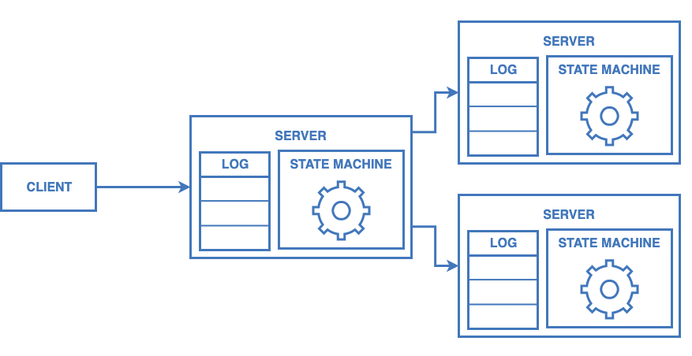
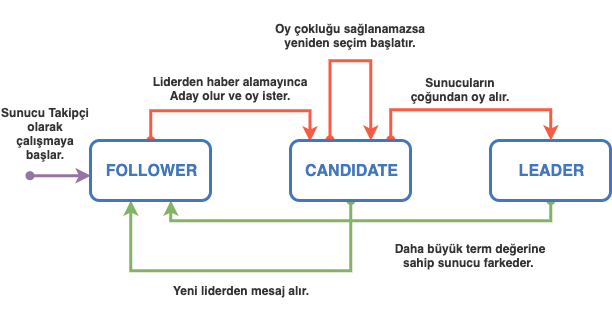

# RAFT


RAFT, sunucular arasında uzlaşma(concensus) sağlayan bir algoritmadır.
 
RAFT sayesinde dağıtık bir sistem, sunucuların yarısından fazlası ayakta kaldığı
sürece, normal bir şekilde hizmet verebilir.

## Uzlaşma(Consensus)

Dağıtık bir sistemde, tüm sunucuların aynı verilere sahip olduğundan emin olmasıdır.
Uzlaşma algoritmaları sunucuların çoğunluğu hizmet verebildiği sürece ilerlemeye devam edebilir. 
Örneğin; 5 sunucuya sahip bir sistem, sunucuların 2si çökse dahi normal bir şekilde hizmet verebilir.

Uzlaşma algoritmalarının hataya tölere şekilde çalışması genellikle çoğaltılmış 
durum makineleri(**replicated state machine**) ile sağlanır. Çoğaltılmış durum makinelerinde,
her sunucunun bir durum makinesi ve makineye gelen komutları kaydettiği bir logu olur.
Buradaki amaç durum makinesini hataya tölere etmektir. 

**Hata töleransı (fault-tolerance)**: Sistemin, bazı parçaları hata verse bile düzgün bir şekilde
hizmet verebilmesidir.

Durum makineleri ve komut kayıtları RAFT gibi bir sistemle çoğaltılarak istemciye(**client**) 
güvenli tek bir durum makinesinde komut çalıştırılıyormuş gibi gösterilebilir.


### Örnek

Sistemin çalışma yapısını bir örnekle açıklayalım.
Elimizde sisteme veri ekleyebildiğimiz bir durum makinesi olsun.
Client bu durum makinesine bir key ile veri ekleme(`add`) komutu gönderebilir.

```python
state_machine = StateMachine()

state_machine.apply('add', 'total', 2020)

```

Bu durum makinesini çoğaltığımız zaman birbirleri ile her zaman senkronize olmasını sağlamamız gerekiyor.

Bunun için durum makinelerine bir komut geldiğinde; 

- önce bu komutu kalıcı bir şekilde sunucuda depolamalı,
- ardından komutu diğer durum makinelerine dağıtmalı
- ve bunun sonunda tüm durum makinelerinde komutu çalıştırmalıyız.



Bütün sunucular her zaman aynı durum makinesine ve loga sahip olacağı için, 
herhangi bir zamanda lider(istek alan sunucu) çökerse kalan 2 sunucudan birisini
lider olarak seçebiliriz.

> Google File System, HDFS, RAMCloud gibi large-scale sistemler olası sunucu çökmelerinde sistemi ayakta
> tutabilmek için; çoğaltılmış durum makinelerini kullanarak lider seçimlerini yönetmekte ve 
> konfigürasyon bilgilerini kaydetmektedir.


## RAFT Uzlaşma Mekanizması

Bir istemci lider sunucuya komut gönderdiğinde, lider bu komutu kendi ve 
diğer takipçi sunucuların loglarına ekler ve komutun çalıştırılmaya uygun olduğuna
karar verdiğinde tüm sunucuların durum makinelerine gönderir.


### Sunucu Rolleri

RAFT algoritmasında uzlaşma aşaması öncelikle bir Lider(**Leader**) seçilerek başlar.
Seçilen lider çoğaltılmış logların yönetilmesinden sorumludur.

Sistemde bütün sunucular Takipçi(**Follower**) durumunda başlar.

Liderden bir süre mesaj alamadığı zaman takipçiler Aday(**Candidate**) durumuna geçer 
ve seçim başlatırlar. Oy çoğunluğuna sahip aday sunucu Lider olur ve
diğer sunuculara yaşam(**heartbeat**) mesajları göndererek liderliğini belirtir.

Liderden mesaj alan Aday sunucular Takipçi durumuna geri dönerler.

Liderin çöktüğü ve yeni bir liderin seçildiği durumda eğer eski lider yeniden 
ayağa kalkarsa, sistemde karışıklık olmaması için RAFT eski lideri bilgilendirir 
ve takipçi durumuna döndürür.



### Çalışma Dönemleri

Sunucuların durumlarını kontrol altında tutmak için RAFT zamanı dönemlere(**term**) böler.
Dönemler artan sayılar şeklinde belirlenir.

Dönemler seçimlerle birlikte değişir ve lider seçildiği dönem boyunca liderliğine devam eder.

Seçimlerde birden fazla sunucu en fazla oyu alırsa o dönem lider seçilmeden biter ve yeniden seçim
başlatılarak yeni bir döneme geçilir.

Her sunucu o anki dönemini kayıtlı tutar ve bir sunucuyla haberleşirken paylaşır. Eğer bir sunucu daha yeni
bir dönem numarasına sahip mesaj alırsa kendini yeni dönemle günceller. Eğer bu sunucu Aday veya Liderse doğrudan
Takipçi durumuna geçer.

Eğer eski bir döneme ait mesaj alınırsa bu mesaj reddedilir.  


### Rollerin Görevleri

#### Ortak Görevler
Tüm sunucular;

-  Yeni bir log commit edilmişse bir sonraki komutu durum makinesinde çalıştırır.
-  RPC isteğinde veya cevabındaki dönem değeri sunucunun döneminden büyükse, sunucu dönemini günceller ve
Follower durumuna geçer.
 
#### Follower

 - Liderden ve Adaylardan gelen tüm RPClere cevap verir.
 - Beklenen süre içerisinde Liderden AppendEntries isteği gelmezse veya
 bir sunucuya oy vermezse Aday konumuna geçer.

#### Candidate

- Aday konumuna geçildiğinde seçim başlatır.
    *  Güncel dönemi bir artırır.
    * Kendine oy verir.
    * Seçim sayacını resetler.
    * Diğer tüm sunuculara RequestVote göndererek oy ister.
- Sunucuların çoğundan oy alırsa Lider konumuna geçer.
- Eğer yeni Liderden AppendEntries mesajı gelirse Takipçi konumuna geçer.
- Eğer seçim sayacı biterse; yeni seçim başlatır.

#### Leader

Raft, takipçileri liderin loglarını kopyalamaya zorlayarak uyuşmazlıkları engeller.
Bu aynı zamanda takipçilerdeki çakışan kayıtların liderin kayıtlarıyla ezilmesi anlamına gelir.


- Seçim süresinde her bir sunucuya boş AppendEntries(heartbeat) mesajı gönderir ve bunu 
yeni bir seçimin başlamaması için kısa aralıklarla sürekli tekrar eder.
- İstemciden komut gelirse; kendi loguna kaydını ekler. Durum makinesine komut uygulandıktan sonra
istemciye cevap verir.
- Loglara yeni kayıt eklenmişse, her takipçiye bütün yeni kayıtları gönderir.
    - Başarılı bir şekilde Takipçiye kayıtlar eklenirse; Takipçinin indeks bilgilerini günceller.
    - Kayıtlar eklenemezse; Log kayıtları uyuşmadığı için kayıtlar oluşturulamamıştır. Takipçinin bilinen
    indeks değerini bir azalt ve tekrar dene. Bu işlem sayesinde Takipçinin uyuşan en son kaydına kadar gidilip o kayıttan
    itibaren tüm uyuşmayan kayıtları liderin kayıtlarıyla değiştirilir.
- Kendi loglarında son commitlenen indeksten daha büyük bir indeks varsa ve
 Takipçilerin çoğunda bu indekse sahip güncel bir kayıt varsa 
 commit indeksini bu indeks ile günceller.

### Haberleşme

RAFT sunucuları [RPC](https://en.wikipedia.org/wiki/Remote_procedure_call) protokolü ile haberleşir ve temel uzlaşım algoritmasını 
kurgulamak için sadece 2 tür RPC mesajı yeterlidir.

**RequestVote** adaylar tarafından, seçim sırasında diğer sunuculardan oy istemek için kullanılır.
```proto
message RequestVote {
  // Adaya ait dönem numarası
  int32 term = 1;  

  // Aday numarası
  int32 candidateId = 2;

  // Adayın en son logladığı komutun indexi
  int32 lastLogIndex = 3;

  // Adayın en son logladığı komutun dönemi
  int32 lastLogTerm = 4;
}

message RequestVoteReply {
  // Oy istenen sunucunun dönem numarası
  int32 term = 1;  

  // Aday oy alması durumunda True olur 
  bool voteGranted = 2;  
}
```

**AppendEntries** lider tarafından log paylaşmak ve diğer sunuculara lider olduğunu belirtmek için kullanılır.
```proto
message Entry {
    // Log kaydının girildiği dönem
    int32 term = 1;
    
    // Loglanan komut
    int32 command = 2;
}

message AppendEntries {
  // Lidere ait dönem numarası
  int32 term = 1;  

  // Liderin idsi, takipçiye gelen bağlantıyı lidere yönlendirmek için
  int32 leaderId = 2;  

  // Yeni kayıtlardan önceki son kaydın indeksi
  int32 prevLogIndex = 3;  

  // prevLogIndexdeki kaydın dönem numarası
  int32 prevLogTerm = 4; 

  // Kaydedilecek log girdileri. Heartbeat mesajları için boş gönderilir.
  repeated Entry entries = 5;

  // Liderin commitlediği son kaydın indeksi.
  int32 leaderCommit = 6;
}

message AppendEntriesReply {
  // Takipçinin o anki güncel dönemi
  int32 term = 1;

  // Eğer başarılı bir şekilde kayıtlar eklendiyse 
  //(prevLogIndex ve prevLogTerm değerleri eşleşiyorsa) True
  bool success = 2;
}
```

### Sunucularda Saklanan Bilgiler

RAFT sunucularında tutulan bilgileri 3 kategoriye ayırabiliriz.

#### Tüm Sunucularda Kalıcı Olarak Saklanan Bilgiler
Bu bilgiler, her RPC cevabından önce sabit diskte güncellenir.

- **currentTerm**: Sunucunun en güncel dönemi. `0`dan başlayıp monoton olarak artar.
- **votedFor**: Dönem için sunucunun oy verdiği Adayın idsi.
- **log[]**: Komut kayıtları. Durum makinesinde için oluşturulan komutları ve komutları kaydeden liderin dönemini içerir.

#### Tüm Sunucularda Değişken Bilgiler
- **commitIndex**: Bilinen en son commit edilmiş log kaydının indeksi. `0`dan başlayıp monoton olarak artar.
- **lastApplied**: En son uygulanan komutun log indeksi. `0`dan başlayıp monoton olarak artar.

#### Lidere Özgü Bilgiler
Bu bilgiler her seçimden sonra yeniden tanımlanır.

- **nextIndex[]**: Her sunucunun bir sonraki kaydı tutacağı log indeksi.
- **matchIndex[]**: Her sunucunun kopyasını tutacağı bilinen en sonuncu kaydın indeksi. `0`dan başlayıp monoton olarak artar.
  
```python
class State:
    log: List[Entry]
    currentTerm: int
    votedFor: int
    commitIndex: int
    lastApplied: int
    ...

class Leader(State):
    nextIndex: List[int]    
    matchIndex: List[int]
    ...

class Candidate(State):
    ...

class Follower(State):
    ...
```

